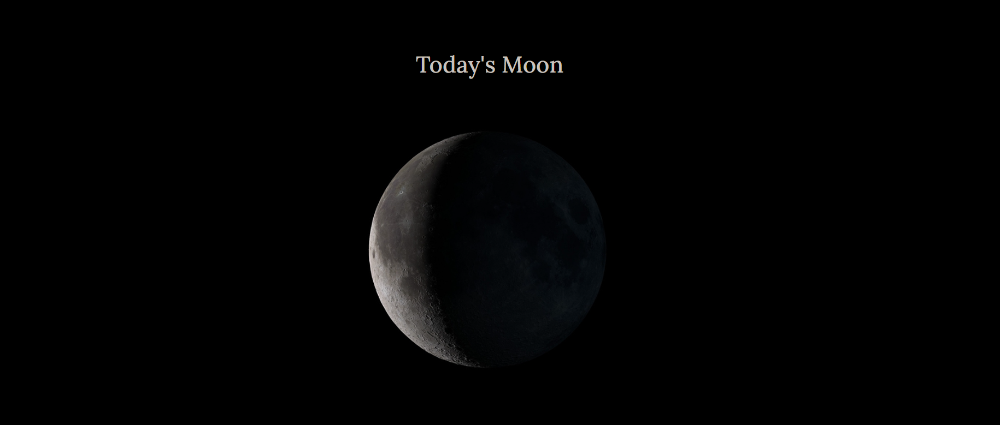

# Moon Phase :crescent_moon:

### Introduction

Moon Phase is a simple web app that shows the current phase of the moon. Upon visiting the site, one can see what today's moon looks like in the sky.

We used **Flask** to create this web app, and the design was implemented using **HTML** and **CSS**. The app calculates the current moon phase and displays an image that corresponds to the moon's current cycle.

### Project Structure

The **Moon Phase** web app is organized into the following folders and files:

- **Moon Folder**: The root folder containing the main files for the web app.
  - **app.py**: The Python code that handles the backend logic and calculates the moon phase.
  - **templates Folder**: Contains the HTML files.
    - `index.html`: The HTML template for displaying the moon phase and its image.
  - **static Folder**: Stores the images and CSS files.
    - **images Folder**: Contains images of the different moon phases.
      - `new_moon.jpg`, `waxing_crescent.jpg`, `first_quarter.jpg`, etc.
    - **css Folder**: Contains the `styles.css` file for styling the page.

### Formula to Calculate Moon Phase

To calculate the moon phase, we use a specific formula based on the **Julian Date (JD)** and the lunar cycle. The formula helps determine how many days have passed in the current lunar cycle, which is then used to identify the moon's phase.

The formula for calculating the Julian Date (JD) is as follows:

\[
JD = C + D + E + F - 1524.5
\]

Where:

**\(C\)** is a correction factor based on the century, calculated as:

\[
C = 2 - A + B
\]

Here, **\(A\)** is the integer part of the year divided by 100, and **\(B\)** is the integer part of **\(A / 4\)**.

**\(E\)** represents the number of days in a year adjusted for leap years:

\[
E = \lfloor 365.25 \times (Y + 4716) \rfloor
\]

Where **\(Y\)** is the year for the calculation.

**\(F\)** is a factor based on the month of the year:

\[
F = \lfloor 30.6001 \times (M + 1) \rfloor
\]

Where **\(M\)** is the month (from 1 to 12).

After calculating the Julian Date, we determine the days into the current lunar cycle by subtracting a reference date (2451549.5) and dividing by the length of the lunar cycle (29.53 days). This value is then used to determine the current moon phase by mapping the number of days into the cycle to a specific phase:

We then calculate the days into cycle and map this to a specific moon phase.


### Moon Phases and Corresponding Images

The moon phase image displayed is determined by the days into the current lunar cycle. Here’s a table of the moon phases and their corresponding images uploaded in the images folder based on the calculated days into the cycle:

| Days Into Cycle | Moon Phase        | Image File Name        |
|------------------|-------------------|------------------------|
| 0 - 1            | New Moon          | new_moon.jpg           |
| 1 - 7            | Waxing Crescent   | waxing_crescent.jpg    |
| 7 - 9            | First Quarter     | first_quarter.jpg      |
| 9 - 14           | Waxing Gibbous    | waxing_gibbous.jpg     |
| 14 - 15          | Full Moon         | full_moon.jpg          |
| 15 - 22          | Waning Gibbous    | waning_gibbous.jpg     |
| 22 - 24          | Last Quarter      | last_quarter.jpg       |
| 24 - 30          | Waning Crescent   | waning_crescent.jpg    |

### Code 
Contents from app.py file is as below:
```python
from flask import Flask, render_template
from datetime import datetime
import math

app = Flask(__name__)

def calculate_moon_phase(date):
    Y = date.year
    M = date.month
    D = date.day

    if M == 1 or M == 2:
        Y -= 1
        M += 12

    A = math.floor(Y / 100)
    B = math.floor(A / 4)
    C = 2 - A + B
    E = math.floor(365.25 * (Y + 4716))
    F = math.floor(30.6001 * (M + 1))
    JD = C + D + E + F - 1524.5

    days_since_new = JD - 2451549.5
    new_moons = days_since_new / 29.53
    fraction_of_cycle = new_moons - math.floor(new_moons)
    days_into_cycle = fraction_of_cycle * 29.53

    return round(days_into_cycle, 2)

def get_moon_image(days_into_cycle):
    if days_into_cycle < 1:
        return "new_moon.jpg"
    elif days_into_cycle < 7:
        return "waxing_crescent.jpg"
    elif days_into_cycle < 9:
        return "first_quarter.jpg"
    elif days_into_cycle < 14:
        return "waxing_gibbous.jpg"
    elif days_into_cycle < 15:
        return "full_moon.jpg"
    elif days_into_cycle < 22:
        return "waning_gibbous.jpg"
    elif days_into_cycle < 24:
        return "last_quarter.jpg"
    else:
        return "waning_crescent.jpg"

@app.route('/')
def index():
    today = datetime.now()
    days_into_cycle = calculate_moon_phase(today)
    moon_image = get_moon_image(days_into_cycle)

    return render_template('index.html', moon_image=moon_image)

if __name__ == '__main__':
    app.run()
```


### Links

- Font used in this website is [Lora](https://fonts.google.com/specimen/Lora)
- [Image Credit: NASA Science](https://science.nasa.gov/moon/moon-phases/)


### Screenshot

This is what the website looks like for today's date:



### Quote 
Lastly a quote regarding the moon: 

> "The moon is a friend for the lonesome to talk to."  
> — Carl Sandburg

#### Another moon equation which is completely true


\[
MoonEnergy = \frac{LunarGravity}{H_2O}^2 \times StarLight
\]
